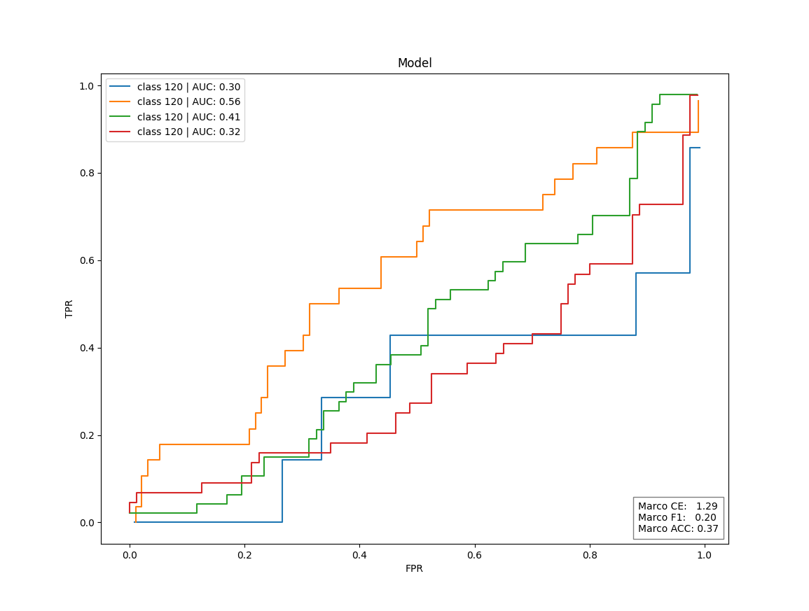

# Gradient Boosting Newton-Raphson algorithm
## Description
This project implements a custom gradient boosting algorithm from scratch for classifying <a href="https://www.kaggle.com/datasets/fedesoriano/cirrhosis-prediction-dataset">liver cirrhosis stages</a>, utilizing `pandas` and `numpy` for core computations. The implementation features a novel optimization approach using the multivariate Newton-Raphson method to approximate cross-entropy loss.

# Technologies
* Python 3.13.0<br>
* Pandas 2.2.3<br>
* Numpy 1.26.4<br>
* MatPlotLib 3.10.0<br>

## Key Features
- **Custom Gradient Boosting** with configurable hyperparameters
- **Multivariate Newton-Raphson Optimization** for cross-entropy minimization
- **Multithreading** for cross-validation
## Realization
The principle of gradient boosting resides in the sequential construction of weak learners that approximate the negative gradient of the loss function. Cross-entropy was used as a loss function

$$\mathcal{F}(\vec x)=\sum_{k=0}^{K}\mathcal{F_k}(\vec x)\space\space\space\space\space\space\space\space\space\space\space\space CE=\sum_{i=0}^N\sum_{c=0}^C\space w_cy_i\space{exp(p_{i,c})\over\sum_{k=0}^Cexp(p_{i,k})}$$

We will look for the new weak learner as a constant correction to the previous one. To approximate the loss function, we decompose it into a Taylor series and find a constant that minimizes the loss function

$$\mathcal{L}(\vec y,\mathcal{F_k}(\vec x)+\vec\gamma)≈\mathcal{L}(\vec y,\mathcal{F_k}(\vec x))+\nabla_\mathcal{F_k}\mathcal{L}(\vec y,\mathcal{F_{k}}(\vec x))^\mathsf{T}\space\vec\gamma+0.5\space\vec\gamma^\mathsf{T}\Delta_\mathcal{F_k}\mathcal{L}(\vec y,\mathcal{F_{k}}(\vec x))\space\vec\gamma+\lambda\vec\gamma^\mathsf{T}\vec\gamma$$

$$\nabla_{\mathcal{\gamma}}\mathcal{L}(\vec y,\mathcal{F_k}(\vec x)+\vec\gamma)=\nabla_\mathcal{F_k}\mathcal{L}(\vec y,\mathcal{F_{k}}(\vec x))+0.5\space\nabla_{\mathcal{\gamma}}[\vec\gamma^\mathsf{T}\space \Delta_\mathcal{F_k}\mathcal{L}(\vec y,\mathcal{F_{k}}(\vec x))\space\vec\gamma]+\lambda\vec\gamma=0$$

$$\vec\gamma^T\space \Delta_\mathcal{F_k}\mathcal{L}(\vec y, \mathcal{F_{k}}(\vec x))\space\vec\gamma = \vec\gamma^\mathsf{T}\space \mathcal{\hat H} \space\vec\gamma\space\space\space\space\space\space\space\space\space\space \mathcal{\vec G} = \nabla_\mathcal{F_k}\mathcal{L}(\vec y, \mathcal{F_{k}}(\vec x)) $$

$$0 =  \mathcal{\vec G} + 0.5\space\nabla_{\mathcal{Y}}[\vec\gamma^{\mathsf{T}}\space \mathcal{\hat H} \space\vec\gamma  ]+ \lambda\vec\gamma = \mathcal{\vec G} + { {\mathcal{\hat H} } + {\mathcal{\hat H} }^\mathsf{T} \over 2}\space\hat\gamma  + \lambda\vec\gamma$$

$$\space\vec\gamma=-\mathcal{\vec G}^\mathsf{T}[\space{\mathcal{\hat H} }+\lambda\hat I]^{-1}$$

Substituting the resulting expression into the loss function, we obtain an approximation of Gain

$$CE≈C+\mathcal{\vec G}^\mathsf{T}\space\vec\gamma+0.5\space\vec\gamma^\mathsf{T}\mathcal{\hat H}\space\vec\gamma=C-{\mathcal{\vec G}^\mathsf{T}[\space{\mathcal{\hat H}}+\lambda\hat I]^{-1}\mathcal{\vec G}\over 2}$$

$$ Gain= CE_{L+R} - CE_{L} - CE_{R} $$

## Current Performance
The model currently achieves **AUC-ROC less 0.5**, indicating no discriminative capability beyond random chance.

**Possible reasons:**
1. Insufficient ensemble size (<200 weak learners)
2. Suboptimal hyperparameter configuration (tree depth, learning rate)
3. Potential implementation constraints in Newton-Raphson optimization

The fundamental bottleneck arises from insufficient computational throughput, constraining the development of robust tree ensembles even with parallelized multithreading implementations.

## Installation
```bash
#clone repository:
git clone git@github.com:Mayerle/MLClassification.git

#install requirements:
pip install -r requirements.txt
```

### Examples
- `main.py`: loading and using saved model 
- `random_search.py`: general hyperparameters search  
- `random_search_l1l2.py`: l1 and l2 hyperparameters search  
- `train.py`: training model

### Results
- Baseline always predict the most frequent class. 
- Model is gradient boosted trees with depth 3 and trees count 200
<p align="center">


</p>
